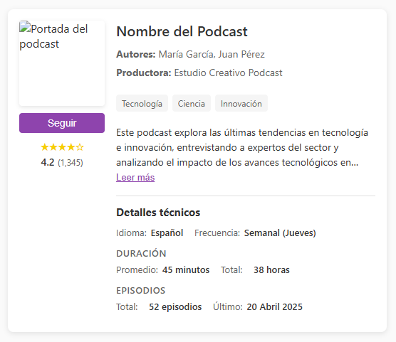

# Tarjetas de Podcast

Componentes de tarjetas para visualización de metadatos de podcasts. Diseños modulares, responsivos y personalizables para implementar en plataformas de streaming de audio.

## Descripción

Este proyecto ofrece componentes frontend para mostrar información de podcasts de manera atractiva y bien organizada. Las tarjetas están diseñadas para presentar metadatos relevantes para los usuarios, como información del show, autores, categorías, descripción y detalles técnicos.

## Características

- Diseño sencillo y limpio
- Totalmente responsivo (adaptable a móviles y tablets)
- Componentes HTML/CSS puros sin dependencias externas
- Funcionalidades interactivas con JavaScript vanilla
- Estructura de código organizada y comentada
- Fácil de personalizar y adaptar

## Casos de uso

- Plataformas de streaming de audio y podcasts
- Directorios de podcasts
- Blogs y sitios web sobre podcasts
- Aplicaciones de descubrimiento de contenido

## Contenido

El repositorio incluye:

- `podcast-show-card.html` - Tarjeta con información del show (básica)
- `podcast-show-card-extended.html` - Tarjeta completa con todos los metadatos
- `podcast-show-card-organized.html` - Versión final con metadatos reorganizados
- Ejemplos de personalización
- Documentación detallada

## Vista previa



## Cómo usar

1. Clona el repositorio:
```bash
git clone https://github.com/tu-usuario/tarjetas-podcast.git
```

2. Abre cualquiera de los archivos HTML en tu navegador para ver cómo lucen las tarjetas.

3. Integra el código en tu proyecto:
   - Copia el fragmento de HTML que necesites
   - Incluye los estilos CSS en tu hoja de estilos o en el `<head>` de tu documento
   - Añade el JavaScript si deseas la funcionalidad interactiva

4. Personaliza los colores, tipografías y dimensiones según tu diseño:
```css
:root {
  --primary-color: #8E44AD; /* Cambia al color principal de tu marca */
  --text-color: #333;
  --light-gray: #f5f5f5;
  /* ... más variables ... */
}
```

## Estructura de metadatos

Las tarjetas están diseñadas para mostrar los siguientes tipos de metadatos:

### Información básica
- Título del podcast
- Autores/Presentadores
- Productora
- Categorías/Tags

### Detalles técnicos
- Idioma
- Frecuencia de publicación
- Duración (promedio y total)
- Información de episodios

### Elementos interactivos
- Botón "Seguir"
- Expansión de descripción
- Valoraciones

## Personalización

Los componentes utilizan variables CSS para facilitar la personalización:

```css
:root {
  --primary-color: #8E44AD;
  --text-color: #333;
  --light-gray: #f5f5f5;
  --medium-gray: #e0e0e0;
  --dark-gray: #666;
  --radius: 8px;
  --shadow: 0 2px 8px rgba(0,0,0,0.1);
}
```

Modifica estas variables para adaptar las tarjetas a tu paleta de colores.

## Responsividad

Las tarjetas están diseñadas para verse bien en dispositivos de cualquier tamaño:
- **Escritorio**: Diseño horizontal con toda la información visible
- **Móvil**: Diseño vertical optimizado para pantallas pequeñas

## Posibles mejoras

- [ ] Versión con React/Vue
- [ ] Temas alternativos (claro/oscuro)
- [ ] Animaciones adicionales
- [ ] Variante con reproductor integrado
- [ ] Soporte para múltiples idiomas

## Licencia

Este proyecto está bajo la Licencia MIT - consulta el archivo [LICENSE](LICENSE) para más detalles.

## Contribuciones

Las contribuciones son bienvenidas. Por favor, abre un issue primero para discutir lo que te gustaría cambiar.

---

Creado con ❤️ para amantes de los podcasts.
